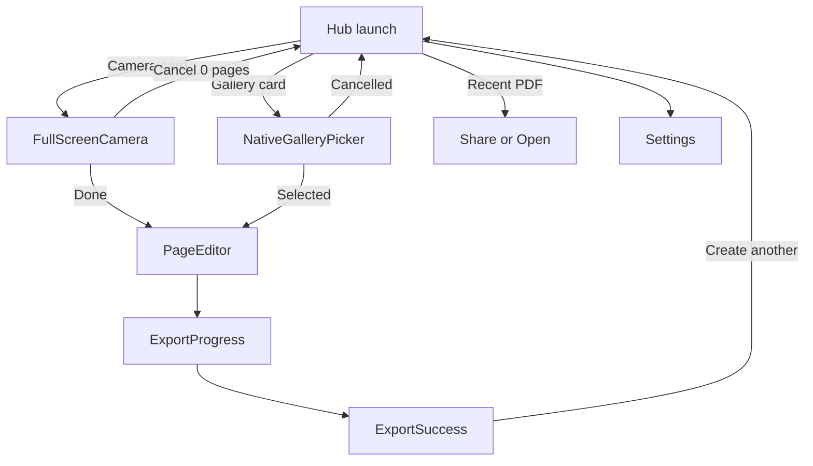

# Product spec: Image to PDF

> **APPROVED** — 2026-08-04. Implementation: [`docs/superpowers/plans/2026-08-04-image-to-pdf.md`](../superpowers/plans/2026-08-04-image-to-pdf.md).

> **UI REDESIGN APPROVED** — 2026-08-08. Direction: retain the indigo identity, remove decorative/card-heavy chrome, prioritize gallery selection, streamline capture/edit/export, and support System, Light, and Dark appearances.

## TL;DR

Build a **mobile, offline image-to-PDF utility** (Expo SDK 54). Core job: capture or pick photos → reorder/crop → export one watermark-free PDF in under a minute, fully on-device. **Phase 1: zero ads.** Phase 2: respectful rewarded + post-export interstitial + remove-ads IAP. Target Play download **< 25 MB**.

**Not PixShrink:** [`image-toolkit`](image-toolkit.md) compresses/resizes images; this app **creates PDFs** only.

---

## Overview

| Field | Value |
|-------|-------|
| **Slug** | `image-to-pdf` |
| **Display name** | Image to PDF |
| **Play Store title** | `Free Image to PDF - Offline` (27 chars; changeable on Play Console) |
| **Android package** | `app.autoapp.imagetopdf` (permanent after first Play upload) |
| **Lane** | `mobile` |
| **Archetype** | `utility` |
| **Path** | `apps/mobile/image-to-pdf/` |
| **Origin** | `manual` |
| **Inspired by** | Image-to-PDF / document scanner category (CamScanner, Adobe Scan, "Image to PDF" utilities) — category only, no brand/logo/copy cloned |
| **Research score** | 31/35 |

### Scorecard

| # | Criterion | Score | Note |
|---|-----------|-------|------|
| 1 | Recurring use | 5 | Receipts, forms, homework, WhatsApp shares |
| 2 | Client-only feasible | 5 | 100% on-device |
| 3 | Discoverability | 5 | "image to pdf", "photo to pdf", "pdf maker" |
| 4 | Competitor gap | 5 | Watermarks, ad-on-save, 80 MB APK, hidden output paths |
| 5 | Monetization path | 4 | Phase 2 rewarded + interstitial + IAP |
| 6 | Build time | 3 | Tight combined v1 in 2–3 sessions |
| 7 | Monetization fit | 4 | Page-count gate; never mid-task |
| | **Total** | **31/35** | Above 26 gate |

### v1 scope decision

**Tight combined (C):** gallery (native picker) + custom full-screen camera + manual crop + multi-page reorder → PDF export. No auto edge detection, no OCR.

---

## Job-to-be-done

**User:** Anyone who needs to submit, share, or archive photos as a single PDF (job applications, receipts, schoolwork, WhatsApp/email attachments).

**Trigger:** "I have photos on my phone and need one PDF file."

**Outcome:** Watermark-free PDF with known file path and size, shareable in under 60 seconds, offline.

## User story

As a **phone user**, I want **to turn photos into a single PDF** so that **I can upload or share one file — without watermarks, ad traps, or hunting for where it was saved**.

---

## Features (v1 — 7 features)

1. **Hub (launch screen)** — Camera + Gallery action cards; Recent PDFs list below. No separate home/splash. No inline camera preview on hub.
2. **Full-screen camera** — Custom `expo-camera` session: multi-page capture, thumbnail strip, Done → editor.
3. **Native gallery pick** — `expo-image-picker` multi-select → Page Editor (no custom gallery grid).
4. **Page editor** — Preview, drag-to-reorder, delete page, add more pages (+).
5. **Manual crop + rotate** — Rectangular crop per page via `expo-image-manipulator`; 90° rotate. No auto edge detect.
6. **Export PDF** — A4 default; progress UI; save to `Documents/ImageToPDF/`; max **500 pages** per document (soft warning at 50+ pages for memory/time).
7. **Export success** — Filename, size, page count, full path, Share sheet, Open in Files, "Create another" → Hub.

**Also v1:** System/Light/Dark appearance setting (System default), offline privacy copy, `accessibilityLabel` on icon buttons, haptics on capture/export.

---

## Differentiation (min 2)

| Wedge | How we deliver it |
|-------|-------------------|
| **Honest export** | No watermark ever; Phase 1 zero ads; export never gated behind video |
| **Transparent output** | Show exact path, PDF size, page count after every export |
| **Small & offline** | Target < 25 MB Play download; no account, no cloud, no subscription |
| **Calm UX** | Hub → capture/pick → edit → export; no ads on Save/Next buttons |

### Competitor pains we avoid

- Ads on "Next" / "Save"
- Watermark on free export
- Weekly subscription traps
- "Something went wrong" after watching an ad
- 80 MB+ utility APK
- Reversed page order after export

---

## Design notes

### Navigation flow



### Screen: Hub (launch)

- **Layout:** Compact app bar + one dominant Gallery action + secondary Camera action + quiet trust line + unframed Recent PDFs list.
- **Primary action:** Choose photos from Gallery; Camera remains a prominent secondary path.
- **Empty state (recents):** "Your exported PDFs appear here."
- **Mockup ref:** `assets/photo-to-pdf-hub-mockup.png` (label: Image to PDF).

### Screen: Full-screen camera

- **Primary action:** Shutter → add page; Done (N) → Editor.
- **Cancel (✕):** Hub if 0 pages; confirm discard if pages captured.
- **Error:** Camera permission → dialog + Open Settings.
- **Mockup ref:** `assets/photo-to-pdf-camera-fullscreen-mockup.png`.

### Screen: Page editor

- **Primary action:** Create PDF in a persistent bottom action area, including current paper/quality context.
- **Secondary:** Crop, Rotate, delete, reorder strip, + add pages. Keep the document preview dominant and controls compact.
- **Error:** "Add at least one page" if empty.

### Screen: Export success

- **Primary action:** Share PDF.
- **Show:** `report.pdf · 2.4 MB · 5 pages` + save location + Create another. Keep the no-watermark confirmation visible but quiet.

### Screen: Settings

- Default paper size (A4), JPEG quality (85%), appearance (System/Light/Dark).
- Privacy: 100% offline. Version.

**Brand:** **Image to PDF** — launcher/display name stays simple; Play title uses ASO keywords.

**ASO short description (first line, draft):** "No watermark. 100% offline. Turn photos into PDF — free forever."

---

## Technical constraints

- [ ] Client-only, no backend (v1)
- [ ] Works fully offline after install
- [ ] Expo SDK 54 scaffold; **omit AdMob SDK in Phase 1 binary**
- [ ] `npm run typecheck && npm run lint && npm test` pass in app dir
- [ ] `npm run validate:mobile -- image-to-pdf` pass from repo root
- [ ] USB dev build tested (`npm run android`) before release — not Expo Go for camera/gallery save

### Stack

| Layer | Choice | Rationale |
|-------|--------|-----------|
| Framework | Expo SDK 54 (managed RN) | Factory lane, CI, reference apps |
| Camera | `expo-camera` full-screen | Multi-page session in one flow |
| Gallery | `expo-image-picker` native multi-select | Familiar UX, less code |
| Crop/rotate | `expo-image-manipulator` | Proven in image-toolkit |
| PDF create | `react-native-pdf-from-image` | Native image→PDF, small; **needs human dep approval** |
| PDF fallback | `expo-print` | Only if native module rejected |
| IO / share | `expo-file-system`, `expo-sharing`, `expo-media-library` | Save + share |
| Haptics | `expo-haptics` | Capture/export feedback |

### New dependencies (human approval required before `npm install`)

```
expo-camera
expo-image-picker
expo-image-manipulator
expo-file-system
expo-sharing
expo-media-library
react-native-pdf-from-image
```

**Do not add:** `react-native-skia`, ML Kit, document-scanner plugins, `react-native-pdf` (viewer), ffmpeg, AdMob (Phase 1).

### Pure logic / test targets (`lib/`)

- Page order persistence during reorder
- PDF export orchestration (mock native module in Jest)
- Recent PDFs list (path, size, date formatting)
- 500-page hard cap enforcement; warn user at 50+ pages (export may be slow / memory-heavy on low-end devices)

---

## APK size budget

| Component | Budget (Play download) |
|-----------|------------------------|
| Expo + RN + Hermes | 14–18 MB |
| Image picker + manipulator + FS | 2–3 MB |
| expo-camera | 1–2 MB |
| react-native-pdf-from-image | 0.5–1 MB |
| Assets | < 1 MB |
| **Phase 1 target** | **< 25 MB ideal** |
| **Hard cap** | **< 40 MB** — investigate before ship |

### Pre-ship size checklist

- [ ] No AdMob in Phase 1 `package.json` / `app.json`
- [ ] No Skia, ML, ffmpeg
- [ ] `enableMinifyInReleaseBuilds: true` after QA pass
- [ ] EAS AAB + ABI splits
- [ ] Measure preview build; record actual size in this spec

See [app-size-optimization](../../.cursor/skills/app-size-optimization/SKILL.md).

---

## Monetization

| Field | Value |
|-------|-------|
| **Primary model** | Phase 1 free, no ads → Phase 2 rewarded + interstitial + remove-ads IAP |
| **Phase 1** | Full core free forever; up to 500 pages/doc; zero ads |
| **Phase 2 trigger** | **500 installs** AND **≥ 14 days** on Play AND **rating ≥ 4.0** — human confirms before enabling |
| **Free path** | Up to 500 pages/doc; no watermark ever |
| **Remove-ads IAP** | $2.49 one-time — disables interstitials; rewarded stays opt-in |

### Ad strategy (Phase 2 only — design now, implement later)

| Feature | Format | Trigger | Reward | Free path | Cap |
|---------|--------|---------|--------|-----------|-----|
| Post-export | Interstitial | After success dismissed, user returns to Hub | None | Skippable after 5s | 1/session, max 1/10 min |
| Remove ads | IAP | Settings | No interstitials | — | One-time |

*Page-count rewarded gate removed — 500 pages free aligns with product wedge. Rewarded for merge-PDF or batch features can be added in v1.1 if needed.*

### Frequency rules

- First session: no interstitials
- Never interstitial on Export, during crop, or before success
- Never interstitial immediately after rewarded
- No banners, app-open ads, or watermarks

Phase 1: ship `lib/monetization.ts` no-op stub; **exclude** `react-native-google-mobile-ads` from binary until Phase 2.

See [mobile-ads-strategy](../../.cursor/skills/mobile-ads-strategy/SKILL.md).

| Phase | Model |
|-------|-------|
| Phase 1 | Core PDF tool; $0 ads; earn reviews + trust |
| Phase 2 | Rare post-export interstitial + remove-ads IAP; no page paywall |

---

## Device QA (human gate)

- [ ] USB dev build on physical Android phone
- [ ] Camera permission flow + full-screen capture multi-page
- [ ] Native gallery multi-select → editor page order preserved
- [ ] Export PDF opens in external viewer; path shown matches Files app
- [ ] Recent PDFs list updates after export
- [ ] Back button: camera → hub, editor → hub, no orphaned state
- [ ] Phase 1 build has no AdMob native module

---

## Success metrics (first 90 days)

| Metric | Target |
|--------|--------|
| Play Store listing | 1 production app |
| Installs | 1,000+ organic (ASO: free image to pdf, offline, no watermark in short description) |
| Store rating | ≥ 4.3 ("no ads, small app, shows file path") |
| Play download size | < 25 MB measured on preview build |
| Phase 2 ads | Enable after 500 installs + human gate |

---

## Out of scope (v1)

- OCR, text search, auto edge detection / perspective deskew
- Password-protect PDF
- Cloud sync, accounts, subscriptions
- Ads (any format) in Phase 1
- Batch 500+ images (hard cap: 500 pages per document)
- PDF merge from existing PDF files
- Watermarks on any tier
- Cross-promo to PixShrink (post-launch only)

---

## Future ideas (parked)

| Idea | Why parked | Revisit when |
|------|-----------|--------------|
| Auto edge detection | ML/native size + complexity | v1.2 if reviews request |
| Password-protect PDF | Extra native PDF lib | v1.1 |
| Merge existing PDFs | Different engine | v1.1 |
| OCR | CamScanner territory; heavy | Phase 2+ differentiation |
| PixShrink cross-link | Focus ship | After both apps live |

---

## Ship checklist

- [x] Spec approved by user (2026-08-04)
- [x] Code in `apps/mobile/image-to-pdf/`
- [x] `app.yaml` filled
- [x] `PLAY_STORE.md` + `PRIVACY.md` (offline angle)
- [x] `store/CREATIVES-BRIEF.md` started
- [x] typecheck + lint + tests green
- [x] `npm run validate:mobile -- image-to-pdf`
- [ ] EAS preview APK on device; size recorded in spec
- [ ] Human approves store submit
- [ ] Release tag `image-to-pdf@v{version}`

---

## Key repo references

- Workflow: [AGENTS.md](../../AGENTS.md), [mobile-dev-cycle](../../.cursor/skills/mobile-dev-cycle/SKILL.md)
- Reference utility: [image-toolkit](image-toolkit.md) (compress — not PDF)
- Reference ads pattern: `apps/mobile/tile-merge/game/monetization.ts`
- Scaffold: `scaffolds/mobile-expo-game/` (copy, never edit in place)
