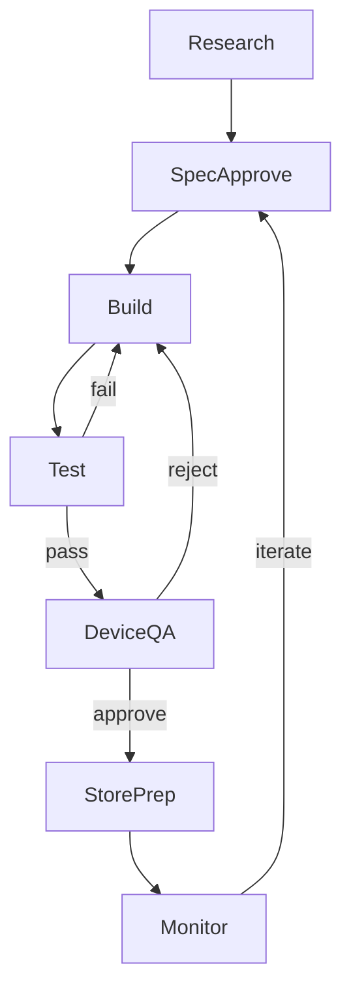

# Mobile Play Store Dev Factory — Design Spec

**Status:** Approved (Sections 1–3)  
**Date:** 2026-08-02  
**Author:** Human + agent brainstorm  

## Overview

Build an agent-optimized workspace for shipping **Play Store mobile apps** (games and utilities) with **ad revenue**, where the human acts as reviewer at every gate and agents handle research, spec, build, test, device QA, store prep, and monitoring.

This is **not** the Python `auto-app` pipeline. It is skills, hooks, scaffolding, specs, and CI wired for Cursor-driven development.

### In scope

- Mobile skills, hooks, scaffold rebuild, spec templates, solutions memory
- USB dev-build device testing (`expo run:android --device`)
- Human-in-loop store creatives (agent provides screenshots + prompts; human designs finals)
- Ad strategy formalized per app in spec

### Out of scope

- New web apps (`apps/web/` archived)
- New extension development (existing extensions maintenance-only)
- Python pipeline automation (`discover`, `build`, `deploy`)
- Autonomous marketing bots or daily auto-deploy

### Reference apps

| App | Role |
|-----|------|
| `apps/mobile/tile-merge/` | Shipped reference — ads, EAS, PLAY_STORE, game patterns |
| `apps/mobile/image-toolkit/` | Future utility reference when utilities start |

---

## 7-Stage Development Cycle

Human approves at **spec**, **device QA**, and **store submit**. All other stages agent-driven with CI as hard gate.



| Stage | Agent | Human gate | Artifact |
|-------|-------|------------|----------|
| 1. Research | `mobile-research`, `product-builder`, `creative-engine` | Pick 1 idea | Research notes |
| 2. Spec + design | `product-builder`, `mobile-ads-strategy`, `monetization`, mock-first design review (`visualize`; `figma-generate-design` for Figma delivery) | **Approve spec and mocks before code** | `docs/specs/{slug}.md` |
| 3. Build | Scaffold + `README-FOR-AGENT`, `app-size-optimization` | Optional chunk review | `apps/mobile/{slug}/` |
| 4. Test | `mobile-testing` | None if CI green | Passing tests |
| 5. Device QA | USB dev build instructions | **Play on phone, approve UX** | Dev build / preview APK |
| 6. Store prep | `play-store-release`, `store-creatives` | Design store graphics; approve submit | `PLAY_STORE.md`, `store/upload/` |
| 7. Monitor | `mobile-monitoring` | Decide vNext | `docs/solutions/{slug}-retro.md` |

**Rule:** Verify failure returns to Build. Store submit blocked until device QA approved.

---

## Device Testing Strategy

### Expo SDK ≠ Expo Go

| | Expo Go | USB dev build |
|---|---------|---------------|
| Native modules (AdMob, IAP) | Not available | Full access |
| Command | `expo start` + QR | `expo run:android --device` |
| Use | Optional JS-only tweaks | **Daily driver** |

### Three tiers

| Tier | Method | When |
|------|--------|------|
| A | Jest + Playwright (CI) | Every commit |
| B | USB dev build | Ads, haptics, native deps, daily UX |
| C | EAS preview APK | Pre–Play Store sign-off |

Setup: Android SDK, `adb`, USB debugging — see `tools/mobile/setup-android-cli.ps1`.

Ad testing: test ad unit IDs only until EAS production profile. Never click production ads. See `.cursor/rules/admob-testing.mdc`.

---

## Skills Architecture

**Entry point:** `.cursor/skills/mobile-dev-cycle/SKILL.md` — orchestrator for stage, next skill, missing artifacts.

| Skill | Stage | Purpose |
|-------|-------|---------|
| `mobile-dev-cycle` | All | Orchestrator |
| `mobile-research` | 1 | Play Store idea research workflow |
| `product-builder` | 2 | Spec gate (narrowed to mobile) |
| `mobile-ads-strategy` | 2 | Senior ad manager: formats, placements, caps, phase 1/2 |
| `creative-engine` | 2 | Idea divergence |
| `monetization` | 2 | Revenue model pick |
| `visualize` / `figma-generate-design` | 2–3 | Mock-first UX review; Figma delivery when requested |
| `app-size-optimization` | 3 | APK size audit |
| `mobile-testing` | 4 | Test pyramid + device tiers |
| `play-store-release` | 6 | Listing, privacy, declarations, tag release |
| `store-creatives` | 6 | Raw screenshots + human creative brief |
| `mobile-monitoring` | 7 | AdMob + Play Console review ritual |

**Existing skills to update (not replace):**

- `product-builder` — mobile-only lane tree
- `mobile-testing` — USB dev build as tier B
- `monetization/rewarded-ux-patterns.md` — referenced by `mobile-ads-strategy`

### Ad strategy skill — required spec sections

Per app, before build:

1. Primary model (rewarded + capped interstitial + remove-ads IAP default for games)
2. Phase 1 (no ads) vs Phase 2 (monetize) trigger
3. Placement map (which feature → which ad format → reward)
4. Frequency caps and session-1 skip rules
5. Free path (core loop playable with zero ads)
6. Test ID vs production ID policy
7. Metrics to watch post-launch (ARPDAU, show rate, D1/D7 retention vs ad density)

---

## Hooks Architecture

Location: `.cursor/hooks/` (new)

| Hook | Trigger | Behavior |
|------|---------|----------|
| `sessionStart` | Repo opened | Remind: mobile factory; read `mobile-dev-cycle` |
| `afterFileEdit` | Save in `apps/mobile/**` | If logic touched → remind `npm test` |
| `beforeShellExecution` (optional) | `git push` + mobile changes | Suggest `validate:mobile` |

Hooks are reminders; CI is the enforcement layer.

---

## Scaffold Design (Option A)

Rebuild `scaffolds/mobile-expo-game/` as **`scaffolds/mobile-expo-app/`** extracted from tile-merge.

### `app.yaml` archetype

```yaml
slug: my-app
lane: mobile
archetype: game   # game | utility
origin: manual
displayName: My App
androidPackage: app.autoapp.myapp
status: scaffold
monetization: rewarded-ads-phase2
```

### Folder structure

```
scaffolds/mobile-expo-app/
├── app.yaml
├── app/                    # expo-router
├── components/
├── game/                   # game archetype: state.ts, tiles, etc.
│   ├── ads/
│   │   └── rewarded.ts     # shared — both archetypes
│   └── monetization.ts     # shared — phase 1/2
├── lib/                    # utility archetype: core logic
├── features/               # utility archetype: screens modules
├── PLAY_STORE.md           # listing stub
├── store/
│   ├── source/             # raw screenshots
│   └── CREATIVES-BRIEF.md  # human GPT prompts
├── eas.json                # preview + production (prod ads flag)
├── README-FOR-AGENT.md     # archetype branches
├── babel.config.js
├── package.json            # NO Skia by default
└── tests/
    └── smoke.test.tsx
```

### Extract from tile-merge into scaffold

- `game/ads/rewarded.ts` pattern (test/production guard)
- `game/monetization.ts` phase config
- `eas.json` profiles
- `PLAY_STORE.md` template (empty fields)
- AdMob app.json plugin config stub
- Jest ad mocks

### Do not bundle by default

- `@shopify/react-native-skia` — add only when spec requires canvas rendering

### Keep unchanged

- `scaffolds/web-nextjs/`, `scaffolds/extension-mv3/` — archived, not deleted

---

## Memory Layer

| Layer | Path | When |
|-------|------|------|
| Skills | `.cursor/skills/` | Process changes |
| Specs | `docs/specs/{slug}.md` | Before build; vNext on iterate |
| Solutions | `docs/solutions/{topic}.md` | After debug pain or store rejection |

### Solution doc template

```markdown
# {Topic}

## Symptom
## Root cause
## Fix
## Prevention (skill/CI/check to add)
```

Seed entries: Expo SDK 54 Skia pin, AdMob test IDs, USB dev build setup, EAS preview install.

---

## Store Creatives (Human-in-Loop)

1. Agent captures raw screenshots → `store/source/*.png`
2. Agent writes `store/CREATIVES-BRIEF.md`:
   - GPT image prompt per screenshot
   - Headline text, brand colors, safe zones
   - Play Store dimension requirements (icon 512, feature 1024×500)
3. Human generates finals → `store/upload/*.png`
4. Agent validates dimensions via script
5. Human uploads to Play Console (API automation later)

---

## Play Store Pre-Launch Checklist

Agent prepares via `play-store-release` skill; human approves submit.

- [ ] `app.yaml` complete
- [ ] Privacy policy URL live
- [ ] Play Console: ads declaration, content rating, data safety
- [ ] Target API level via `expo-build-properties`
- [ ] EAS production AAB
- [ ] Store listing copy + graphics in `store/upload/`
- [ ] Internal track first
- [ ] AdMob linked; production ads only on production EAS profile
- [ ] `EXPO_PUBLIC_USE_PRODUCTION_ADS=true` only in production profile

---

## Implementation Phases

| Phase | Deliverables |
|-------|--------------|
| **0** | Update STRATEGY.md, AGENTS.md — mobile-only focus |
| **1** | `mobile-dev-cycle`, `mobile-ads-strategy`, `docs/solutions/` |
| **2** | Scaffold rebuild, hooks, `play-store-release`, `store-creatives`, `mobile-monitoring`, update `mobile-testing` |
| **3** | Mobile spec template sections, `tools/mobile/validate.mjs` extensions |
| **4** | Prove cycle on second app (post tile-merge ship) |

---

## Success Criteria (90 days)

| Signal | Target |
|--------|--------|
| Apps through full cycle | 2+ (tile-merge live + 1 new) |
| Spec with ad placement map | 100% |
| USB dev build before store | 100% |
| Store rejections documented | 100% in solutions/ |

---

## Key Decisions

1. Mobile-only factory; web archived; extensions maintenance-only
2. No Python pipeline automation for now
3. Human reviewer at spec, device QA, store submit gates
4. Flexible `game | utility` archetype; tile-merge ships first
5. Single scaffold from tile-merge (Option A)
6. USB dev build daily; Expo Go optional only
7. Store creatives human-designed from agent prompts
8. **Tech stack: Expo-managed React Native** (not Expo Go sandbox) — see below
9. **New dependency rule:** agent must get human approval before `npm install` of any package not already in scaffold `package.json`

---

## Tech Stack: Expo vs “React Native Only”

### Short answer

**You already build on React Native.** Expo is the **toolchain and SDK layer on top of React Native** — not a different app platform. For this repo, keeping Expo is the right call. You are **not** limited to Expo Go or “Expo-only libraries.”

### What each piece is

| Piece | What it is | Your project |
|-------|-----------|--------------|
| **React Native** | UI framework (JS → native Android/iOS) | Core — all mobile code |
| **Expo SDK** | RN + prebuilt modules + config (`expo-haptics`, `expo-router`, etc.) | tile-merge, image-toolkit, scaffold |
| **Expo Go** | Prebuilt sandbox app for quick preview | **Optional only** — AdMob does not work here |
| **Dev build** (`expo run:android`) | **Your** app compiled with full native access | **Daily USB testing** |
| **EAS Build** | Cloud CI that produces Play Store AAB/APK | tile-merge release workflow |
| **Bare React Native** | RN without Expo CLI/EAS — you wire Gradle/Xcode yourself | Not used today |

### Is Expo ideal for you?

**Yes**, for your goals (solo builder, Play Store ads, agent-driven factory, fast ship):

| Factor | Expo + dev build | Bare React Native |
|--------|------------------|-------------------|
| Play Store AAB | EAS one command | Manual Gradle/signing setup |
| AdMob native module | Config plugin + dev build | Same native module, more manual linking |
| USB install on phone | `expo run:android --device` | `npx react-native run-android` (similar, more config) |
| Agent scaffolding | One `app.json`, known patterns | Many native files — agents make more mistakes |
| Existing apps | tile-merge shipped on Expo 54 | Rewriting = weeks of work |
| Library freedom | Any RN lib with config plugin | Slightly wider, but you manage all native config |

**When bare RN wins:** large team, heavy custom native code, or leaving Expo ecosystem entirely. That is not your situation today.

### What “Expo” does in practice (not mandatory confusion)

- **Mandatory for this repo:** Expo SDK + EAS + expo-router — because everything is already built on it.
- **Not mandatory:** Expo Go app on your phone. You use **dev builds** instead.
- **Not a library prison:** `react-native-google-mobile-ads`, gesture-handler, reanimated, Skia — all work via dev build. tile-merge already proves this.

### Scaffold naming

Folder name is cosmetic. Options:

| Name | Meaning |
|------|---------|
| `mobile-expo-app` | Honest — signals Expo-managed RN stack |
| `mobile-play-store-app` | Product-focused; README states Expo underneath |
| `mobile-expo-game` (current) | Less churn; upgrade contents only |

**Recommendation:** Keep **`mobile-expo-game`** folder name (less churn) OR rename to **`mobile-play-store-app`** if you want product language in paths. Tech stack stays Expo-managed React Native either way.

---

## Agent Rule: Dependency Approval Gate

Before any agent runs `npm install <package>` (or adds to `package.json`):

1. **State:** package name, version, why needed, APK size impact if known
2. **Wait** for human approval
3. **Only then** install

**Allowed without asking** (already in scaffold or explicitly listed in `README-FOR-AGENT.md` allowed-deps section):

- Packages already in scaffold `package.json`
- Deps listed in skill allowlists (e.g. `zustand`, `async-storage`, `expo-haptics` for games)

**Always requires approval:**

- Any new npm package not in scaffold
- Native modules (AdMob, camera, etc.)
- Replacing a library with an alternative

This rule goes in: `AGENTS.md`, `mobile-dev-cycle` skill, scaffold `README-FOR-AGENT.md`.

---

## Package Manager: npm (not pnpm) — for now

### Short answer

**Stay on npm** for this repo today. pnpm's main win (workspace linking + disk dedup) does not apply yet; mobile + Expo is where pnpm causes the most friction.

### Why not pnpm right now

| Factor | This repo | pnpm impact |
|--------|-----------|-------------|
| Install model | Each app under `apps/mobile/{slug}/` runs its own `npm install` | No root workspace — pnpm store benefit minimal |
| Expo / Metro | Expects flat `node_modules` for native modules | pnpm symlinks break resolution unless `node-linker=hoisted` in `.npmrc` — then behaves like npm anyway |
| EAS Build | Detects lockfile type | `pnpm-lock.yaml` works but another thing to validate per release |
| CI / agents | `mobile-ci.yml`, skills, AGENTS.md all say `npm` | Migration = update workflows, skills, docs, every app |
| Shared `packages/` | **Does not exist yet** | This is when pnpm becomes worth revisiting |

### When to switch to pnpm

Revisit when **any** of these land:

- Shared code in `packages/` consumed by multiple mobile apps (`workspace:*` linking)
- 5+ mobile apps and install time/disk becomes painful
- Deliberate monorepo workspace with one lockfile + `pnpm -r` scripts

### If we migrate later

```ini
# .npmrc — required for Expo
node-linker=hoisted
auto-install-peers=true
strict-peer-dependencies=false
```

Plus: `pnpm-workspace.yaml`, update all CI workflows, skills, and scaffold READMEs. **Do not mix** npm for some apps and pnpm for others.

### Decision

**npm** is the package manager for Phase 0–4 implementation. Document in `AGENTS.md` and `mobile-dev-cycle` skill.
